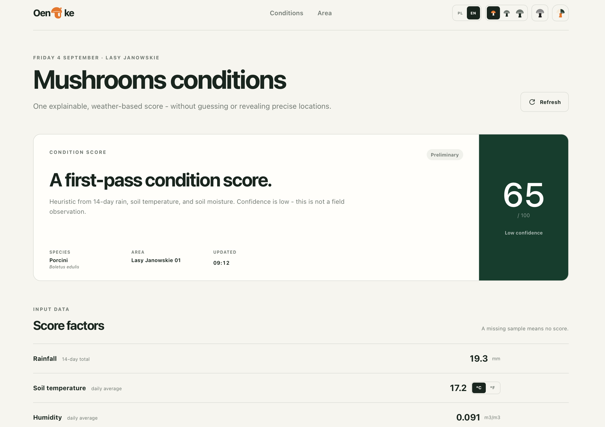
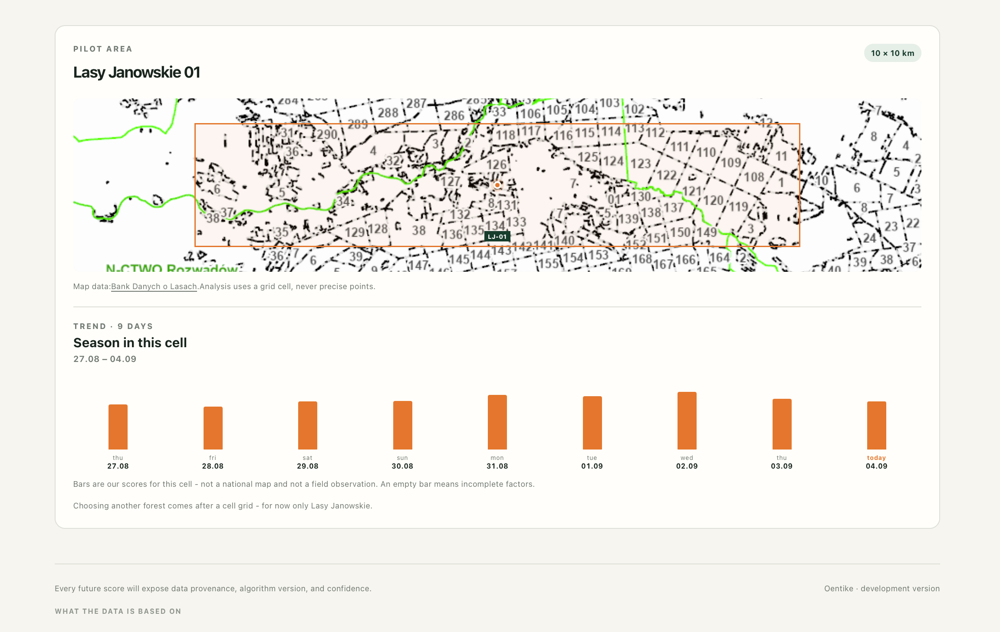

<div align="center">


Local mushroom-conditions helper for Polish forests: explainable scores, a coarse seasonal map, offline atlas later.

[](./oentike-api)
[](./oentike-api/migrations)
[](./oentike-web)

<p>

</p>
<p>

</p>

</div>

---

## Product

Pilot: one 10 km cell **Lasy Janowskie** (Targowisko / Studzieniec), species `boletus-edulis`. `task oentike:ingest` writes Open-Meteo hours into PostGIS; while `serve` is up it also ingests about once an hour (skipped if the last fetch is younger than 50 minutes). `GetConditions` scores that cell with `oentike-conditions/0.1.0-boletus` when all three factors exist and returns `fetched_at` of that ingest. `GetSeason` returns the last 9 Warsaw days of **our** scores for the same cell — empty days stay `unavailable`, never a fake Poland heatmap.

```bash
task dev
```

| What | Where |
|---|---|
| HTTP health / ready | `http://127.0.0.1:8081/healthz`, `/readyz` |
| Conditions RPC | gRPC `:8082` `GetConditions`, `GetSeason` |
| PostGIS | `127.0.0.1:5432` database `oentike` |

```bash
grpcurl -plaintext -d '{"cell_id":"lasy-janowskie-01"}' \
  127.0.0.1:8082 oentike.conditions.ConditionsService/GetConditions

grpcurl -plaintext -d '{"cell_id":"lasy-janowskie-01"}' \
  127.0.0.1:8082 oentike.conditions.ConditionsService/GetSeason
```

Stop UI/API with `Ctrl+C`. Stop PostGIS with `task oentike:down`.

---

## Layout

| Path | Role |
|---|---|
| `oentike-api/` | PostGIS migrations, gRPC conditions, Open-Meteo ingest |
| `oentike-proto/` | `conditions.proto` |
| `oentike-web/` | Astro UI + Tauri desktop (`/` conditions, `/atlas` cards) |
| `oentike-atlas/` | Versioned species cards (pilot pack, no scores) |
| `docker-compose.yml` | PostGIS (`profile: oentike`) |

---

## Tooling

Pinned in [`mise.toml`](./mise.toml): Go, Rust, protoc. `task --list` is the list.

```bash
mise install
mise trust
task --list
```

| Task | What |
|---|---|
| `dev` | Proto + migrate + API + Tauri |
| `oentike:up` / `oentike:down` | Start / stop PostGIS |
| `oentike:migrate` | Goose migrations |
| `oentike:proto` | Generate gRPC stubs |
| `oentike:api` | Health `:8081` + gRPC `:8082` (hourly Open-Meteo ingest in the background) |
| `oentike:ingest` | One-shot Open-Meteo → `ingest_runs` + `weather_samples` |
| `oentike:test` | Go tests |
| `oentike:ui` | Desktop only (`FRESH=1` clears Tauri cache) |
| `setup` | npm + rustup if missing |
| `clean` | `cargo clean` in Tauri (after moving the repo) |
