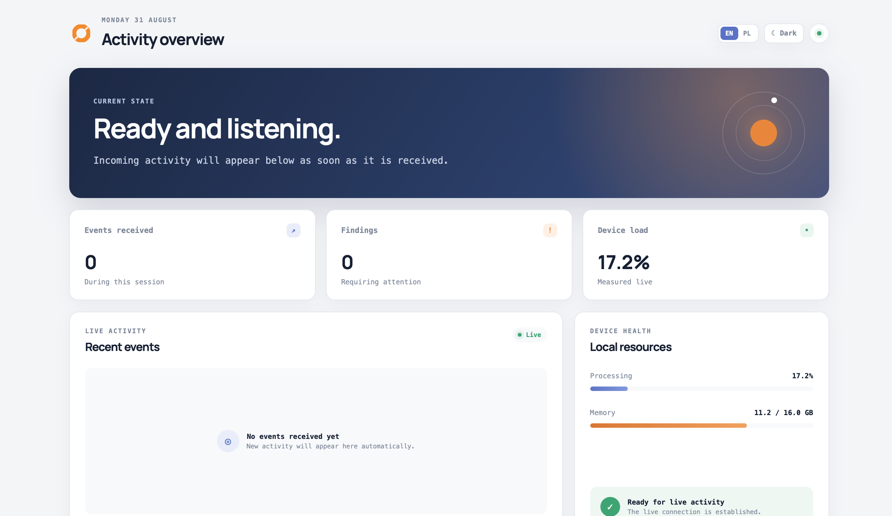
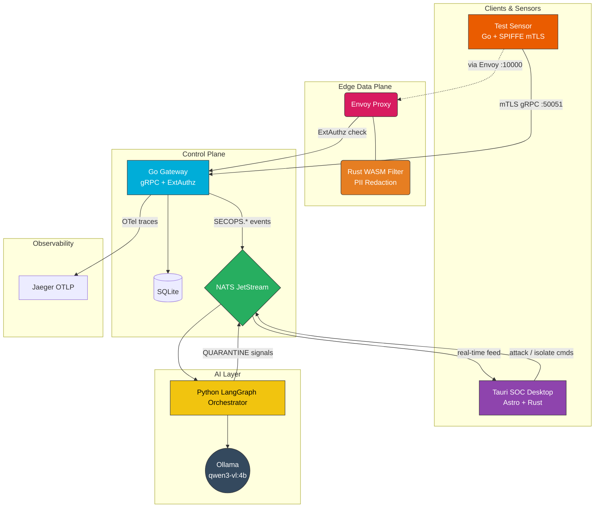

<div align="center">


# Oentike

> **Work in progress.** This is an active research and portfolio project — APIs, UI flows, and integration paths change frequently. Expect rough edges and incomplete hardening. See [Troubleshooting](#troubleshooting) if `task dev` fails after moving the repo.

[](./oentike-control-plane)
[](./oentike-wasm-filter)
[](./oentike-web)
[](./oentike-ai-orchestrator)
[](./spire)
[](./nats.conf)

*An event-driven SecOps platform that combines SPIFFE/mTLS identity, Envoy L7 policy enforcement, a Rust WASM edge filter, and a LangGraph-powered SOC analyst — with a native desktop command center.*



</div>

---

## What This Is

Oentike is a hands-on research platform for **cloud-native security engineering**. It demonstrates how modern zero-trust primitives — workload identity, mutual TLS, external authorization, and active stream termination — can be wired into an autonomous response loop driven by telemetry and local LLM analysis.

The goal is not a production SIEM replacement, but a **credible, end-to-end reference** for topics that matter in network security, cloud architecture, and DevSecOps roles: identity at the edge, policy enforcement in the data plane, event-driven orchestration, and operator-facing observability.

### What works today

| Capability | Implementation |
|---|---|
| **Workload identity** | SPIRE server/agent, X.509 SVIDs, mTLS between sensor and control plane |
| **L7 policy enforcement** | Envoy ExtAuthz → Go control plane; quarantined SPIFFE IDs receive `403 Forbidden` |
| **Active kill switch** | Go context cancellation tears down live gRPC streams on `QUARANTINE` events |
| **Edge WASM filter** | Rust `proxy-wasm` module redacts sensitive payloads (e.g. AWS keys) in-flight |
| **AI threat analysis** | Python LangGraph agent consumes NATS JetStream events via Ollama (`qwen3-vl:4b`) |
| **Desktop UI** | Tauri 2 + Astro dashboard with live event intake, findings, connection state, and host resource usage |
| **Distributed tracing** | OpenTelemetry → Jaeger (OTLP gRPC on `:4317`, UI on `:16686`) |

---

## Architecture



### Design pillars

**1. Zero-trust identity (SPIFFE / SPIRE)**
Every workload obtains a cryptographic identity (X.509 SVID). The Go control plane and test sensor authenticate via mTLS. Envoy terminates TLS and forwards SPIFFE principals to ExtAuthz. No implicit trust — connections without a valid SVID are rejected.

**2. Dual-layer remediation (ExtAuthz + context cancellation)**
- **New connections:** Envoy queries the Go PDP; quarantined identities get `403 Forbidden`.
- **Active streams:** The control plane maintains per-agent context watchers and calls `cancel()` on live gRPC streams when a `QUARANTINE` event arrives over NATS.

**3. Edge WASM protection (Rust / proxy-wasm)**
A compiled WASM module runs inside Envoy. It inspects HTTP bodies at line speed, redacts known secret patterns (e.g. `AKIA…` AWS access keys), and emits telemetry without round-tripping to the control plane.

**4. AI-assisted SOC (LangGraph + NATS)**
The Python orchestrator batches security events from JetStream, runs structured threat analysis through a local LLM, and publishes `QUARANTINE` / `MONITOR` recommendations back to the bus — closing the loop without a cloud API dependency.

---

## Technology Stack

| Layer | Technologies |
|---|---|
| **Edge proxy** | Envoy v1.31, Rust WASM (`proxy-wasm`, `wasm32-wasip1`) |
| **Control plane** | Go 1.27, gRPC, Envoy ExtAuthz, GORM + SQLite, NATS JetStream |
| **AI orchestration** | Python 3.12, LangGraph, LangChain, Ollama (`qwen3-vl:4b`) |
| **SOC UI** | Astro 7, Tauri 2 (Rust), Chart.js, 3D Force Graph, NATS |
| **Identity** | SPIFFE / SPIRE 1.10 |
| **Observability** | OpenTelemetry, Jaeger |
| **Tooling** | [mise](https://mise.jdx.dev), [Task](https://taskfile.dev), Docker Compose |

Tool versions are pinned in [`mise.toml`](./mise.toml) and each component's dependency manifest.

---

## Prerequisites

| Tool | Purpose |
|---|---|
| [mise](https://mise.jdx.dev) | Pins Go 1.27, Rust 1.97, Python 3.12, protoc |
| [Task](https://taskfile.dev) | Runs all dev workflows (`task --list`) |
| [Docker](https://www.docker.com) | NATS, SPIRE, Envoy, Jaeger containers |
| Node.js ≥ 22.12 | Astro / Tauri frontend |
| Ollama | Local LLM inference (installed by `task setup` on macOS) |

```bash
# Install pinned runtimes (from repo root)
mise install
mise trust
```

---

## Quick Start

### Option A — SOC desktop UI only

Best for exploring the dashboard, crypto stream, and topology visualization.

```bash
task setup          # npm deps + optional brew packages
task nats           # NATS JetStream on :4222
task dev            # Tauri desktop app (Astro + Rust backend)
```

When backend services are offline, the UI reports the unavailable connection and does not fabricate replacement data.

### Option B — Full stack (recommended)

Launches SPIRE, NATS, Jaeger, Go control plane, AI orchestrator, Ollama, Envoy WASM proxy, Tauri SOC app, and the test sensor concurrently.

```bash
task setup
task start-all
```

> **First run:** `task start-all` compiles the WASM filter, pulls the Ollama model (`qwen3-vl:4b`, ~2–4 GB), and registers SPIRE identities. Expect 2–5 minutes on a fresh machine.

### Option C — Kill-switch demo (headless)

A scripted end-to-end proof of active stream termination — no UI required.

```bash
./demo_kill_switch.sh
```

This boots SPIRE + NATS + control plane + Envoy, starts the mTLS test sensor, publishes a `QUARANTINE` event, and verifies the gRPC stream is forcefully closed.

### Generate integration-test traffic

The desktop UI is read-only and displays only received events and measured host data. To generate explicit test traffic, run the integration client separately:

```bash
cd test-client && go run .
```

---

## Task Reference

```bash
task --list
```

| Task | Description |
|---|---|
| `setup` | Install npm deps and optional system packages (Ollama, socat, Python) |
| `nats` | Start NATS JetStream container |
| `spire` | Bootstrap SPIRE server/agent + register workload identities |
| `wasm` | Build the Rust WASM filter for Envoy |
| `server` | Run Go control plane on `:50051` |
| `ai` | Run Python LangGraph orchestrator |
| `ollama` | Start Ollama and pull `qwen3-vl:4b` |
| `envoy` | Run Envoy with mounted WASM filter on `:10000` |
| `clean` | Remove stale Tauri/Cargo artifacts only |
| `dev` | `npm install` + clean cache + launch SOC desktop app |
| `sensor` | Run Go test sensor (mTLS telemetry client) |
| `start-all` | Launch everything concurrently |

Individual tasks can be run in separate terminals for debugging:

```bash
task nats & task spire & task server & task ai & task ollama & task wasm & task envoy & task dev
```

---

## Project Structure

```
Oentike/
├── oentike-control-plane/   # Go gRPC gateway, ExtAuthz PDP, approval worker, OTel
├── oentike-wasm-filter/     # Rust proxy-wasm edge filter (PII redaction)
├── oentike-ai-orchestrator/ # Python LangGraph SOC analyzer
├── oentike-web/             # Astro frontend + Tauri 2 desktop application
│   └── src-tauri/           # Rust event bridge and host resource measurements
├── test-client/             # Go mTLS sensor for integration testing
├── trigger/                 # NATS publish helper for kill-switch demo
├── spire/                   # SPIRE server/agent configuration
├── envoy.yaml               # Envoy listener, mTLS, WASM, ExtAuthz routing
├── docker-compose.yml       # NATS, SPIRE, Jaeger, Envoy services
├── register_spire.sh        # SPIRE bootstrap + workload registration
├── demo_kill_switch.sh      # Headless kill-switch demonstration
├── Taskfile.yml             # Developer workflow automation
└── mise.toml                # Pinned toolchain versions
```

---

## Ports & Endpoints

| Service | Port | URL / Notes |
|---|---|---|
| Go control plane (gRPC) | 50051 | mTLS via SPIFFE |
| Envoy proxy | 10000 | L7 gateway with WASM + ExtAuthz |
| Envoy admin | 9901 | `http://localhost:9901` |
| NATS | 4222 | Client connections |
| NATS WebSocket | 9222 | WebSocket clients (`ws://localhost:9222`) |
| Jaeger UI | 16686 | `http://localhost:16686` |
| OTLP gRPC | 4317 | OpenTelemetry exporter target |
| Ollama | 11434 | `http://localhost:11434` |

> NATS HTTP monitoring (`:8222`) is not enabled or exposed. Port `9222` is exclusively the WebSocket listener and returns `400 Bad Request` to ordinary HTTP requests; a valid WebSocket upgrade returns `101 Switching Protocols`.

---

## Why These Technologies

This stack is deliberately **niche and production-adjacent** — the kind of tooling you encounter in cloud-native security and platform engineering, not in a typical CRUD tutorial:

- **SPIFFE/SPIRE** — CNCF-standard workload identity; replaces static cert management in microservice meshes.
- **Envoy + ExtAuthz** — industry-standard L7 policy enforcement point (same family as Istio/Contour data planes).
- **proxy-wasm** — sandboxed, hot-swappable edge logic without recompiling the proxy.
- **NATS JetStream** — lightweight, cloud-native event bus with persistence and consumer groups.
- **LangGraph** — structured multi-step AI workflows with typed outputs (not a single prompt-and-pray call).
- **Tauri** — native desktop shell with Rust IPC; lower overhead than Electron for a SOC operator console.
- **OpenTelemetry** — vendor-neutral tracing, exportable to Jaeger, Grafana Tempo, or any OTLP backend.

---

## Troubleshooting

### `task dev` fails with `app_hide.toml` / permissions errors

```bash
task dev FRESH=1
```

`FRESH=1` clears stale Tauri cache (needed after moving the repo). Normal runs skip the clean step.

### Live activity is empty

**Use the desktop window** opened by `task dev` — not `http://localhost:4321` in a browser. The UI does not generate fallback data. An empty feed means no event has been received during the current session.

---

<div align="center">

*Built as a technical portfolio piece exploring zero-trust networking, edge security, and AI-assisted incident response.*

</div>
