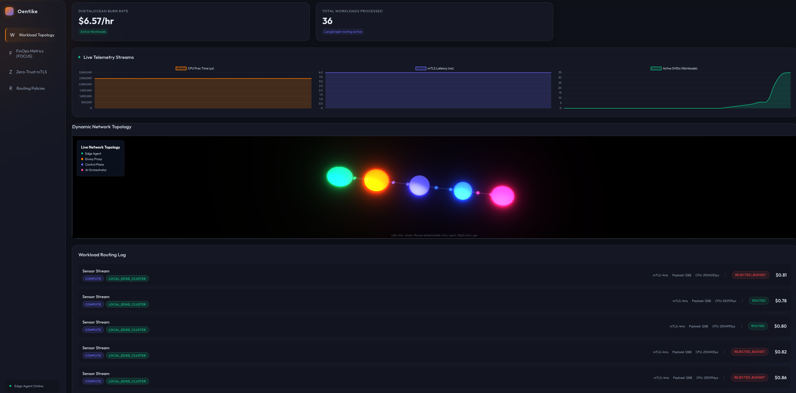
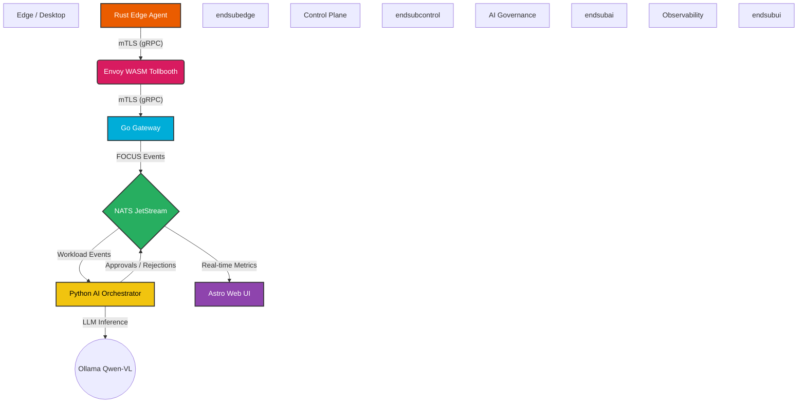

  
# Oentike
**Cost Control & Governance Platform**

*Modern IT encounters two critical challenges: uncontrollable cloud waste and unpredictable decisions. Oentike solves both by establishing a cryptographically secure, multi-agent gateway.*

---

## The Vision

In an era of decentralized infrastructure, granting raw API access for cloud provisioning is a massive risk. ZT-FinGate acts as an intelligent, intercepting gateway that evaluates financial requests (such as scaling an EC2 cluster or provisioning managed databases) before they reach the cloud provider. 

Instead of static rules, it uses a Multi-Agent LLM System to analyze requests based on dynamic budgets and business context. To ensure absolute security, it implements a strict Zero-Trust network architecture (SPIFFE/mTLS), guaranteeing that only cryptographically verified applications can submit requests.

## Core Architecture

<table>
<tr>
<td width="50%">

### 🛡️ 1. Zero-Trust Networking
*(SPIFFE/SPIRE & mTLS)*

No application is trusted by default, regardless of its network location.
- **Workload Identity:** Every service gets a cryptographic identity via a local SPIRE server.
- **mTLS:** All gRPC communication is secured. Connections lacking a valid SPIFFE ID are instantly dropped at the transport layer (Envoy).

</td>
<td width="50%">

### 🧠 2. AI Governance
*(LangGraph & Qwen-VL)*

AI models shouldn't govern resources without strict oversight. We utilize local LLMs via **Ollama**.
- **Analyst Agent:** Extracts context, cost, and risk parameters from the request.
- **Auditor Agent:** Critiques the decision, checks for hallucinations and FinOps policy violations.

</td>
</tr>
<tr>
<td width="50%">

### 📊 3. FinOps Standard
*(FOCUS)*

All financial events are normalized to the FOCUS (FinOps Open Cost & Usage Specification) standard. 
Costs are tracked, categorized, and streamed in real-time, providing total visibility into the operational burn rate.

</td>
<td width="50%">

### ⚡ 4. Event-Driven Backbone
*(NATS JetStream)*

Microservices communicate asynchronously via NATS JetStream. 
This provides an immutable, replayable audit log of every financial decision and infrastructure change, enabling robust tracing and real-time dashboarding.

</td>
</tr>
</table>

## Technology Stack
* **Edge Data Plane:** Rust, Iced (GUI Chat), Tonic (gRPC)
* **Control Plane:** Go, GORM, SQLite, NATS JetStream
* **AI Orchestration:** Python, LangGraph, LangChain, Ollama (Qwen 3.5 1.4b)
* **Observability & UI:** Astro, Vanilla CSS, Native WebSockets

## System Workflow

1. A developer uses the Rust Edge Agent to chat with the system (e.g., "We need 5 new EC2 instances for the holiday season").
2. The request is cryptographically signed and sent via mTLS to the Go Control Plane.
3. The Gateway verifies the SPIFFE ID and publishes the text event to the NATS cluster.
4. The Python AI Orchestrator consumes the event. The Qwen 3.5 Analyst Agent extracts data and evaluates the business justification.
5. The Qwen 3.5 Auditor Agent verifies the decision for compliance. If safe, it approves the request.
6. The state change is streamed instantly via WebSockets to the Astro Dashboard, rendering rich FinOps visualizations.

---
*Developed as a comprehensive proof-of-concept for Cloud Architecture, FinOps, and DevSecOps.*
