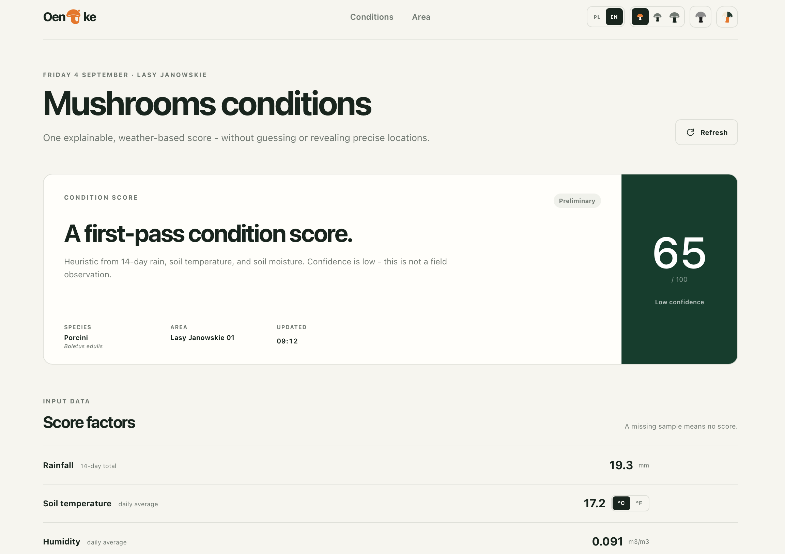
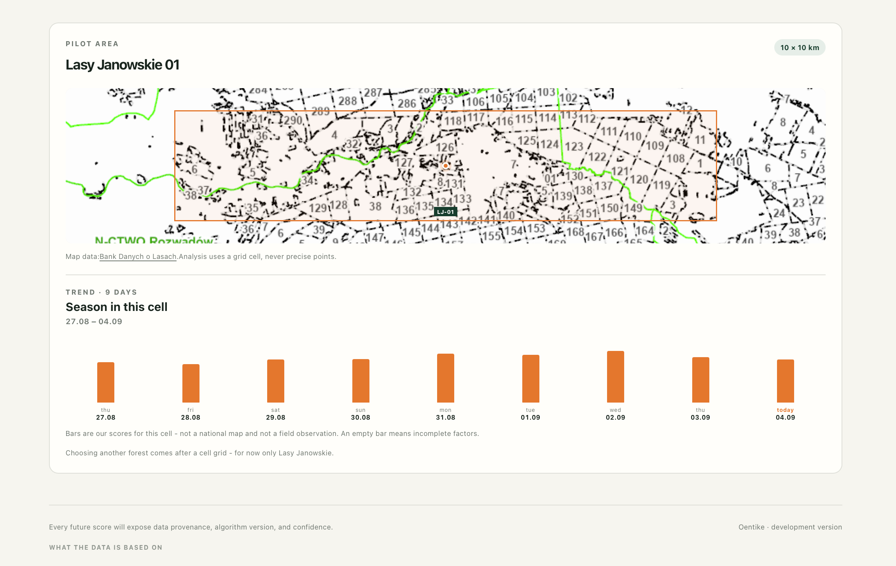

<div align="center">


Local mushroom-conditions helper for Polish forests: explainable scores, a coarse seasonal map, offline atlas later.

[](./oentike-api)
[](./oentike-api/migrations)
[](./oentike-web)

<p>

</p>
<p>

</p>

</div>

---

## Product

Pilot: searchable **BDL nadleśnictwa** (~429 after `task oentike:sync-bdl`), default **Nadleśnictwo Janów Lubelski** (`nadl-05-31`), species `boletus-edulis`. UI typeahead calls `SearchCells` over `forest_units`; selecting an area materializes it into `cells` and ingests Open-Meteo on demand (`EnsureCell` / `GetConditions`). Score color tracks 0-100 on the panel. `task oentike:ingest` refreshes weather for **materialized** cells only (`CELL=id` for one); while `serve` is up the background loop refreshes each due materialized cell about once an hour (skipped per cell if the last fetch is younger than 50 minutes). `GetConditions` scores with `oentike-conditions/0.1.0-boletus` when all three factors exist and returns `fetched_at` of that ingest. `GetSeason` returns the last 9 Warsaw days of **our** scores for the selected cell - empty days stay `unavailable`, never a fake Poland heatmap.

```bash
task oentike:sync-bdl
task dev
```

| What | Where |
|---|---|
| HTTP health / ready | `http://127.0.0.1:8081/healthz`, `/readyz` |
| Conditions RPC | gRPC `:8082` `GetConditions`, `GetSeason`, `SearchCells`, `EnsureCell` |
| PostGIS | `127.0.0.1:5432` database `oentike` |

```bash
grpcurl -plaintext -d '{"cell_id":"nadl-05-31"}' \
  127.0.0.1:8082 oentike.conditions.ConditionsService/GetConditions

grpcurl -plaintext -d '{"cell_id":"nadl-05-31"}' \
  127.0.0.1:8082 oentike.conditions.ConditionsService/GetSeason

grpcurl -plaintext -d '{"query":"Janów"}' \
  127.0.0.1:8082 oentike.conditions.ConditionsService/SearchCells

grpcurl -plaintext -d '{"cell_id":"nadl-05-31"}' \
  127.0.0.1:8082 oentike.conditions.ConditionsService/EnsureCell
```

Stop UI/API with `Ctrl+C`. Stop PostGIS with `task oentike:down`.

---

## Layout

| Path | Role |
|---|---|
| `oentike-api/` | PostGIS migrations, gRPC conditions, Open-Meteo ingest, BDL WFS sync |
| `oentike-proto/` | `conditions.proto` |
| `oentike-web/` | Astro UI + Tauri desktop (`/` conditions, `/atlas` cards) |
| `oentike-atlas/` | Versioned species cards (pilot pack, no scores) |
| `docker-compose.yml` | PostGIS (`profile: oentike`) |

---

## Quick start

Install Docker with Compose and the platform prerequisites for Tauri (on macOS: Xcode Command Line Tools). With mise installed:

```bash
mise trust
mise install
./oentike doctor
./oentike setup
./oentike dev
```

`setup` uses `npm ci` and the committed lockfile. Run it after web dependency changes; daily startup does not install packages. `mise.toml` includes Node and Task as well as Go/Rust/protoc. The launcher uses `mise exec` when available and otherwise uses tools already on PATH. It also works when invoked from another directory.

Generated protobuf bindings are committed; ordinary startup does not regenerate them. After changing `conditions.proto`, use `task oentike:proto`. Full BDL import remains explicit: `task oentike:sync-bdl`.

| Command | Purpose |
|---|---|
| `./oentike` / `./oentike dev` | Start PostGIS, migrate, run API and desktop UI |
| `./oentike doctor` | Check required tools, Compose and Docker daemon without installing |
| `./oentike setup` | Install web dependencies from lockfile |
| `./oentike check` | Go tests, atlas validation and production UI build (no DB required) |
| `./oentike atlas` | Check all cards, cross-references and SVG assets |
| `./oentike bench` | Repeat deterministic spatial/scoring benchmarks three times |
| `./oentike stop` | Stop PostGIS; stop the foreground dev processes with Ctrl+C |
| `task oentike:ingest` | Refresh materialized cells (`CELL=id` for one) |
| `task oentike:ui` | Desktop only; `FRESH=1` explicitly clears build cache |

The atlas now contains 11 cards. New cards include linked sources; older cards still need editorial review. See [atlas workflow](./oentike-atlas/README.md), [performance measurements](./docs/PERFORMANCE.md) and [development roadmap](./docs/ROADMAP.md).

The current conditions screen still needs the local API and online map tiles. A standalone offline expedition pack is the next functional milestone, not a capability claimed by this release.
